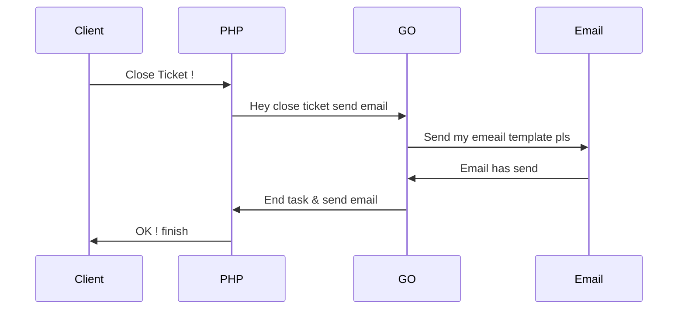

---
tags:
  - Projetos
Date: 2024-10-10
---

## Sistema Heterogêneo

**Login**

Usuário autenticado grava os dados de acesso de mail no Laravel onde o GOlang não tem o menor conhecimento  de tais dado quando acorre uma requisição dados sao transitados do PHP para GO 

